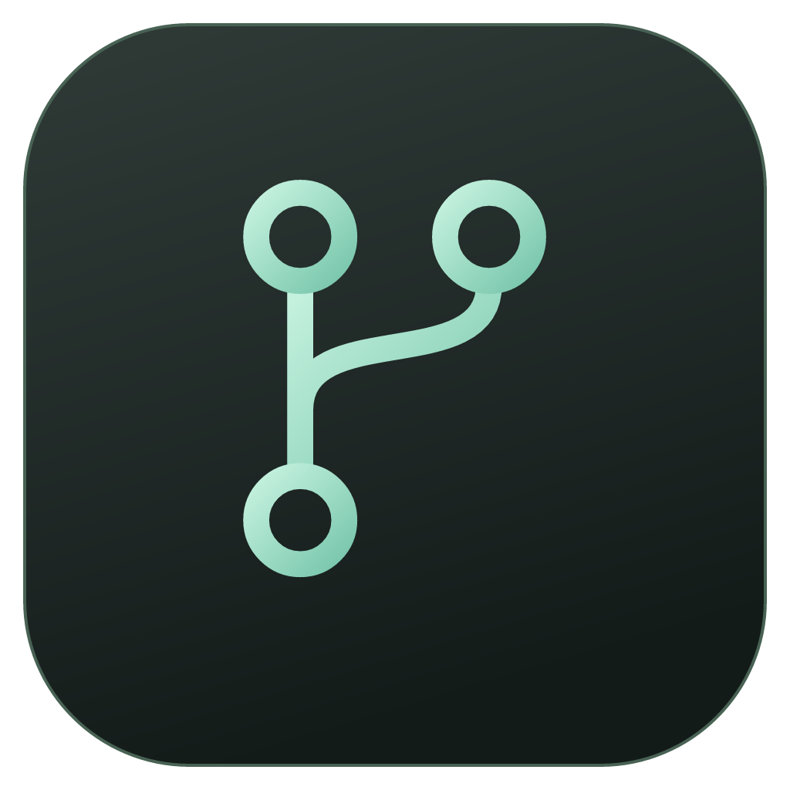
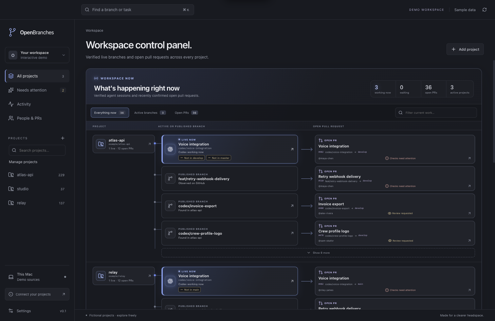
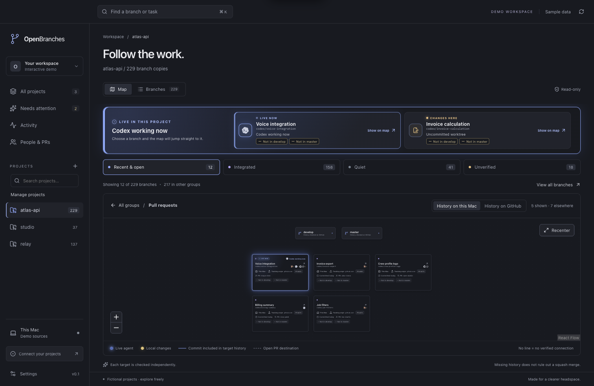
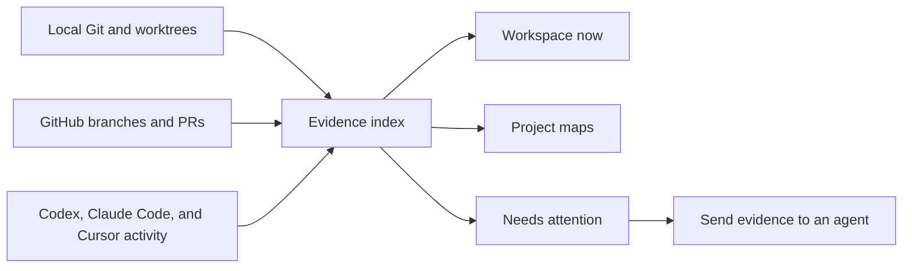

<p align="center">
  
</p>

<h1 align="center">OpenBranches</h1>

<p align="center">
  See what is being worked on, where every branch lives, and whether the work reached <code>develop</code> or <code>main</code>.
</p>

<p align="center">
  <a href="https://github.com/Charlesmendez/OpenBranches/actions/workflows/checks.yml"></a>
  <a href="LICENSE"></a>
  
</p>

> **Download v0.1.0:** [Apple silicon (M1 and newer)](https://github.com/Charlesmendez/OpenBranches/releases/download/v0.1.0/OpenBranches-0.1.0-mac-arm64.dmg) · [Intel](https://github.com/Charlesmendez/OpenBranches/releases/download/v0.1.0/OpenBranches-0.1.0-mac-x64.dmg). Both installers are signed with Developer ID and notarized by Apple.



Coding agents can create dozens or hundreds of branches across repositories and worktrees. Git has the facts, but it does not give you a control panel. OpenBranches turns that evidence into one searchable workspace without changing your repositories.

## What you can see

- **What is happening now.** A workspace control panel puts active agent sessions and open pull requests across every project in one view.
- **Where the work lives.** See the repository, branch, local checkout, worktree, remote copy, pull request, and last activity behind each item.
- **What reached `develop` or `main`.** The map checks commit ancestry against each integration target independently and labels the result on the branch.
- **Who or what is working.** OpenBranches can attribute fresh local activity to Codex, Claude Code, Cursor, or a model reported by the connected tool.
- **What needs a decision.** A bounded review inbox groups forgotten, unpublished, and unintegrated work. Select one branch or many and send the evidence to Codex, Claude, or Cursor for investigation.

Large workspaces stay readable by collapsing inactive branches into groups, paging dense results, and promoting verified live work. Search remains available across every monitored project.

## Follow one project without losing the workspace



The project map keeps current work visible above the graph and makes active branches easy to find. Lines represent verified Git relationships: a solid line means the commit is included in the target history, and a dashed line represents an open pull request destination. No line means OpenBranches has not verified a connection. It does not guess that a squash merge happened from a similar branch name.

## Connections

| Source      | What OpenBranches uses                                | Connection                                                        |
| ----------- | ----------------------------------------------------- | ----------------------------------------------------------------- |
| Local Git   | Branches, worktrees, changes, commits, remotes        | Automatic after you choose or follow a repository                 |
| GitHub      | Published branches, pull requests, reviews, checks    | Public data works without sign-in; private data uses a GitHub App |
| Codex       | Recent task-to-checkout activity                      | Optional local connection in Settings                             |
| Claude Code | Session-to-project activity                           | Optional local history and live hook                              |
| Cursor      | Live checkout activity and explicitly reported models | Optional live hook                                                |

Local changes update while the app is open. GitHub requests use per-repository freshness windows, conditional responses, and rotating budgets so a large workspace does not repeatedly download unchanged data. The title bar shows when a source is refreshing, delayed, partial, disabled, or rate limited.

## Install

### Public release

The intended installation is the normal Mac flow:

1. Download the [Apple silicon (`arm64`)](https://github.com/Charlesmendez/OpenBranches/releases/download/v0.1.0/OpenBranches-0.1.0-mac-arm64.dmg) or [Intel (`x64`)](https://github.com/Charlesmendez/OpenBranches/releases/download/v0.1.0/OpenBranches-0.1.0-mac-x64.dmg) DMG from the [latest GitHub Release](https://github.com/Charlesmendez/OpenBranches/releases/latest).
2. Open the DMG and drag OpenBranches into Applications.
3. Launch the app and follow automatically discovered projects, or choose a repository folder.
4. Optionally connect GitHub and local coding-agent history in Settings.

End users will not need Node.js, npm, Xcode, or an Apple Developer account. Git 2.36 or newer is required for local inspection; OpenBranches detects common Apple and Homebrew installations and guides the user through Apple's Command Line Tools installer when Git is missing.

The public downloads are signed with the project's Developer ID, notarized by Apple, and accompanied by SHA-256 checksums. Files ending in `-unsigned.dmg` are local development builds. See the detailed [Mac installation guide](docs/INSTALLATION.md).

### Run from source

Contributors need macOS, Git, and Node.js 24:

```sh
git clone https://github.com/Charlesmendez/OpenBranches.git
cd OpenBranches
npm ci
npm run dev
```

To open the fictional browser preview without scanning local repositories:

```sh
npm run dev:web
```

To create an unsigned installer for the current Mac:

```sh
npm run make
npm run verify:macos -- --arch=arm64 # use x64 on an Intel Mac
```

Artifacts are written under `out/`. Packaging does not upload them.

## How it works



The desktop app reads local Git state and combines it with bounded GitHub snapshots and optional agent-runtime evidence. Integration labels come from commit ancestry checks. Live indicators require fresh evidence that a task or hook is using the exact checkout; an old commit timestamp alone does not make a branch appear active.

## Local first and read-only

Repository inspection is read-only. OpenBranches does not fetch into your repositories, commit, push, merge, rebase, delete branches, or remove worktrees.

- Repository paths and Git evidence stay on the Mac in a personal workspace.
- Agent connections discard prompts, responses, commands, and tool input; they retain the minimum checkout and activity metadata needed for attribution.
- Sending a review creates an explicit handoff to the selected local coding agent. OpenBranches does not run a hidden recommendation model.
- Removing a project stops monitoring and clears its cached connection metadata without touching the repository.

Read more about the [architecture](docs/ARCHITECTURE.md), [agent attribution](docs/AGENT_ATTRIBUTION.md), and [review handoffs](docs/HANDOFFS.md).

## Team workspaces

The optional team preview combines GitHub activity with local work that each teammate chooses to share. It includes people and project permissions, device pairing and revocation, permission-aware search, grouped branch reports, and a small company priority queue. Personal repository paths and unpublished work are not shared unless the user opts in.

The service and Mac companion are implemented as an isolated fictional preview. Real multi-device validation and production deployment remain before a team release. See [team scope and privacy](docs/TEAM_WORKSPACES.md), the [service preview](docs/TEAM_SERVICE.md), and the [Mac companion](docs/TEAM_COMPANION.md).

## Project status

OpenBranches v0.1.0 is publicly available for Apple silicon and Intel Macs. The desktop application, Git evidence model, workspace control panel, project maps, review handoffs, source health, GitHub connection, and signed release pipeline are implemented. The release workflow built and verified each installer on its matching native Mac architecture, including its signature, stapled notarization ticket, mounted bundle, architecture, and checksum.

The optional self-hosted team workspace remains a preview. Broader clean-machine, macOS-version, and assistive-technology testing continues after the initial desktop release.

The [roadmap](docs/ROADMAP.md) tracks the full release scope and known limits.

## Contributing

Issues and pull requests are welcome. The integration branch is `develop`: update it, create one focused branch, and open the pull request back to `develop`.

Before submitting code, run:

```sh
npm run typecheck
npm test
npm run format:check
npm run build
```

Changes that affect Git classification, credentials, privacy, or agent attribution should include meaningful tests and explicit evidence. See the [contributor workflow](docs/WORKFLOW.md) and [architecture guide](docs/ARCHITECTURE.md).

## Releasing

The release workflow builds separate native Apple silicon and Intel DMGs, signs the app with Developer ID, submits it for Apple notarization, verifies the mounted bundle and stapled tickets, and generates SHA-256 checksums. It leaves the GitHub release in draft form for clean-machine review.

A direct GitHub DMG does not require a Mac App Store listing or App Store review. The project maintainer needs the Apple Developer membership and release credentials; contributors and users do not. See the [release guide](docs/RELEASING.md).

## License

[MIT](LICENSE) © Carlos Mendez.

OpenBranches is an independent project and is not affiliated with Apple, Anthropic, Cursor, GitHub, OpenAI, or xAI.
